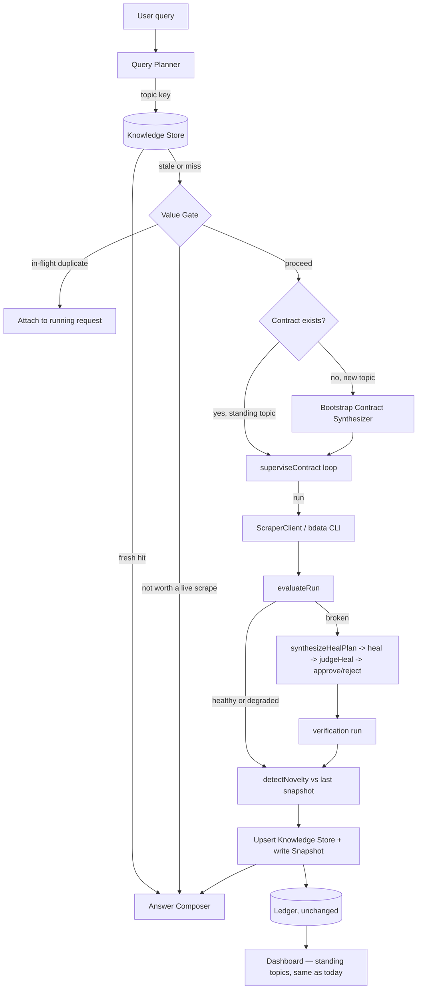

# Anansi Radar — abstract and architecture

Status: Phase 1 is built, tested, and verified against the live collector —
`anansi ask` and the interactive dashboard (`pnpm dashboard`) both work end to
end. This document is also the record of what changed once real infrastructure
disagreed with the design: see the "What Phase 1 actually taught us" note at
the end of the Build sequence.

## Abstract

Anansi already answers one question well: *is this collector still telling the
truth?* It scores every run against a contract, writes its own repair prompt
when a field goes quiet, and refuses a fix that doesn't verifiably hold. That
engine doesn't care where a run came from — it only needs a contract and a set
of rows.

Anansi Radar puts a question in front of it instead of a schedule: a user asks
for something in plain language, and the system decides whether it already
knows the answer, whether that answer is still fresh, and — only if neither is
true — spends a scrape to find out. The same score → heal → gate → verify loop
now runs underneath a search bar instead of a cron job, and its novelty diff
becomes the thing the user actually sees: not "here is data," but "here is
what changed since you last asked."

The three open problems this solves, from the discussion that produced it:

1. **Self-healing without a pre-written contract.** A repeat topic reuses the
   contract from the first time it was asked. A genuinely new topic bootstraps
   its own contract from its own first successful run — the shape it proved it
   could deliver becomes the standard every later run is held to.
2. **Not spending credits on low-value scrapes.** Nothing hits Bright Data
   before a cache and dedupe check. A topic only earns a standing, scheduled
   collector once it's popular enough to be asked repeatedly; a true one-off
   is scraped live and left ephemeral.
3. **Knowing what's stale and updating it honestly.** Every entry in the
   knowledge store carries a freshness class and a last-confirmed timestamp.
   Refreshing never wipes and replaces — it upserts by identity key through
   the same novelty engine already built, so a row that's temporarily missing
   from one run isn't mistaken for a row that's gone.

## System architecture



## Components

| Component | Status | Responsibility |
| --- | --- | --- |
| `evaluateRun` | **built** | Score rows against a contract; unchanged. |
| `synthesizeHealPlan` / `judgeHeal` | **built** | Write the heal prompt, gate the proposed fix; unchanged. |
| `superviseContract` | **built** | The run → heal → gate → verify loop; unchanged, just invoked by a query instead of a sweep. |
| `detectNovelty` | **built** | Diff current rows against the last snapshot by identity key; becomes the "what's new" the user sees. |
| `Snapshots` | **built** | Last known-good rows per contract; becomes part of the Knowledge Store's freshness data. |
| `Ledger` | **built** | Append-only audit trail; unchanged, keeps recording every decision regardless of trigger. |
| **Query Planner** | new | Free-text ask → topic key. Decides: cache lookup, existing contract reuse, or a brand-new topic. |
| **Knowledge Store** | new | Persisted answer per topic: rows, `lastConfirmedFresh`, `freshnessClass`, `sourceCollectorId`. |
| **Value Gate** | new | Cache-freshness check, in-flight dedupe, and the standing-vs-ephemeral decision, all *before* any credit is spent. |
| **Bootstrap Contract Synthesizer** | new | First successful run on a novel topic becomes its own contract: infers field types and required-ness from what actually came back non-null and well-typed. |
| **Answer Composer** | new | Renders the response with a freshness badge ("confirmed fresh 2h ago"), sourced from the Knowledge Store. |
| **Cost-Tiered Escalator** | new | Tries the cheap scraper type first, escalates only the rows that need it. See below. |
| **Freshness Learner** | new | Adjusts a topic's TTL from its own novelty history instead of a fixed table. See below. |

### Cost-Tiered Escalator

Discovery+PDP costs roughly 200x a plain Discovery scrape (Bright Data's own
sizing). Radar never jumps straight to the expensive tier:

1. Run Discovery (or a Search-type collector) — cheap, one page load per topic.
2. Score the rows against the contract as usual. Some required fields —
   typically the ones only a detail page carries — will legitimately be
   `minFillRate: 0` on a Discovery-only contract and are expected to be empty
   at this tier.
3. For the identities that are missing a field the *user's query actually
   needs*, and only those, escalate: run a targeted PDP fetch per missing
   identity, merge the result back in by identity key.
4. Log the tier actually used per topic in the Knowledge Store
   (`"discovery"` or `"discovery+pdp:<n> rows escalated"`), so the UI can show
   the cost decision, not just the data.

This turns "which scraper type to use" from a one-time developer choice into a
per-query, per-row runtime decision — the same kind of judgment a person would
make by hand, made automatically.

### Freshness Learner

Starts from the static `freshnessClass` default, then adjusts using the exact
signal `detectNovelty` already produces:

- Last 3 checks showed `newCount + changedCount == 0` → double the TTL (cap at
  30 days). Nothing about this topic is moving; stop spending credits on it.
- A check shows `changedCount / rowCount > 0.2` → halve the TTL (floor at the
  freshness class's minimum). Something is moving faster than assumed.
- Otherwise, TTL is unchanged.

Recorded as a `freshness_adjusted` ledger event, so "why did this topic's TTL
change from 24h to 72h" is answerable from history, the same way a heal is.

## UI plan — the Radar view

A new page on the dashboard, alongside the existing collector fleet view
(which stays as-is for the standing/scheduled contracts).

**Search bar.** One input, one button. Typing a query and submitting is the
entire interaction — no dashboard-hopping, matching the "the terminal/one
surface is the UI" best practice from the brief.

**Live pipeline strip**, shown only while a query is actually being resolved
(a cache hit skips straight to the answer):

```
cache check -> not fresh -> scraping (Discovery) -> scoring -> [healing -> gate] -> done
   ✓              ✓             ●  running                                       ○
```

Each stage lights up as it completes, reusing the same status-pill styling
already built for collector health. This is the single most demoable piece of
new UI — a judge watching the video sees the exact loop from the architecture
diagram happen in real time.

**Answer view**, once resolved:

- Freshness badge: `confirmed fresh · 2h ago · next check in 22h`, or
  `refreshed just now` when a live scrape just ran.
- Source tag: `via c_8f2a91 · Discovery` or `· Discovery, 3 rows escalated to PDP`
  — the cost-tier decision, shown, not hidden.
- Results as cards, each annotated by novelty kind:
  - 🆕 **new** — a plain new card.
  - 🔄 **changed** — the card shows the delta inline: `price  $15.00 → $12.50`,
    reusing `FieldDelta` directly, old value struck through.
  - unchanged rows render plainly, no badge — the badge is the point; a
    screen full of them would defeat it.

**Topic detail** (click into any answered query — same interaction as
clicking a collector card today):

- The existing decision-log timeline component, unmodified: run → health →
  heal_proposed → heal_gated → heal_settled → verified, exactly as it renders
  for the fleet today. A topic bootstrapped five minutes ago and a collector
  that's been running for a week use the identical timeline renderer.
- A freshness sparkline: TTL over time, with a marker at each
  `freshness_adjusted` event and why it fired.
- The current Knowledge Store entry for this topic, raw: every row, its
  `lastConfirmedFresh`, and which tier (Discovery vs Discovery+PDP) produced it.

Nothing here is a new visual language — it's the fleet dashboard's existing
card, timeline, and status-pill components, pointed at a topic instead of a
static contract file. That's deliberate: one design system, reused, rather
than a second UI to build and keep consistent under time pressure.

## Data model sketch

```ts
interface KnowledgeEntry {
  topicKey: string;              // normalized query -> stable key
  contractId: string;            // reused or bootstrapped
  collectorId: string;           // c_* — same one healing operates on
  rows: Row[];
  identityField: string;         // from detectNovelty / Contract.identityField
  freshnessClass: "volatile" | "daily" | "weekly" | "stable";
  ttlSeconds: number;            // derived from freshnessClass, adjustable
  lastConfirmedFresh: string;    // ISO timestamp of last successful run
  standing: boolean;             // true once popular enough for the nightly sweep
  askCount: number;              // drives the standing/ephemeral decision
}
```

`freshnessClass` starts from a static default per field type (a `price`-like
number defaults to `volatile`; a `date`/biographical string defaults to
`stable`) and can later be tightened or loosened by watching how often
`detectNovelty` actually reports changes for that topic — a topic that never
changes earns a longer TTL on its own.

## Build sequence

**Phase 0 — done.** Contract schema, health scoring, heal-prompt synthesis,
the approval gate, the supervisor loop, the ledger, novelty diffing, the CLI,
the Break Room demo target, the dashboard, CI.

**Phase 1 — done.** Query Planner (`planTopicKey`: normalize + slugify the
ask), a JSON-file Knowledge Store, a static freshness-class table with the
Freshness Learner (`adjustTtl`) adjusting it from real novelty history, the
Bootstrap Contract Synthesizer, the Cost-Tiered Escalator's decision logic
(`planEscalation` — tested, not yet wired to a second live scraper tier), and
`resolveQuery` tying it together. `anansi ask "<query>"` and the interactive
dashboard (`pnpm dashboard`) both run it end to end against the live
collector. A bootstrapped topic writes into the same `contracts/` directory
the scheduled fleet reads from, but stays out of an unattended sweep until
`KnowledgeEntry.standing` — asked more than once — says otherwise.

**What Phase 1 actually taught us.** Three real bugs only showed up by
genuinely breaking the live collector and running the full loop against it —
none of them were things unit tests alone would have caught:

- Bright Data's Discovery envelope for a single page nests the real item list
  inside an unpredictable field name (`[{ models: [...] }]`), not a flat
  array — the payload parser was flattening it into one meaningless row.
- A heal's approval-gate preview is itself a *summary*, not a full run —
  observed live: a 5-row result truncated to 2 full rows plus a literal
  `"3 more items"` string mixed into the array. Judging that preview against
  the contract's real `shape.minRows` rejected a genuinely correct fix for
  looking short. The gate now scores a preview purely on field correctness;
  the real row count is still fully enforced by the verification run that
  follows an approval.
- The Bootstrap Contract Synthesizer's integer detection stripped non-digit
  characters before parsing — for all-text values like `"Nimbus Titan"` that
  leaves `""`, and `Number("")` is `0`, a valid integer. Every plain-text
  field in a bootstrapped contract was silently typed as `integer`.

The lesson generalizes: a system whose whole premise is "verify against
reality, don't trust the happy path" has to be built the same way. Replaying
fixtures proves the *logic*; only running against the real collector — and
deliberately breaking it — proved the *parsing*.

**Phase 2 — roadmap, not today.** Wiring the Cost-Tiered Escalator to an
actual second scraper tier (needs a target with real list + detail pages —
the Break Room is single-page), a real query planner (LLM-assisted topic
decomposition, multi-source fan-out), a hosted knowledge store instead of
JSON files, and popularity-based promotion into the nightly sentinel sweep.
